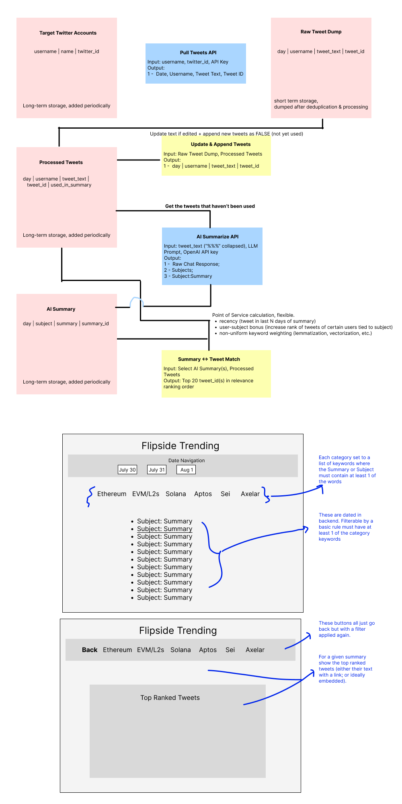

# trending-topics
 Pipelines & NLP for identification of trending topics in crypto, by ecosystem, over the last 24-48 hours.
 
 Full pipeline diagram included as an image + pdf. 
 
 1. Pulls `target_twitter_accounts` and calls `pull_account_tweets`.
 2. Dump dataframe form in `raw_tweet_dump`, call `add_new_tweets()` proc to clean & append to `processed_tweets`.
 3. Ingest unused tweets to call `chatgpt_id_topic` at the day-ecosystem level and get the `subjects` and `summaries`. 
 4. Update used tweets to `used_in_summary = TRUE` and insert into `ai_summary`.
 
 Website (in-dev) offers a UI over the summaries that uses term frequency to link back to 
 relevant tweets at the day-ecosystem level.
 
 
